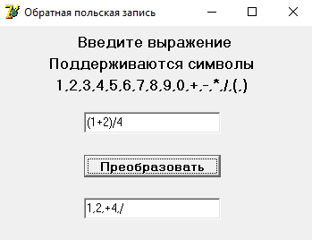

# Reverse-Polish-Notation
(Delphi) Program that translates a normal entry to reverse polish notation

#Basic Overview
Program translates normal expressions to reverse polish notation using simpla stack algorithm.

